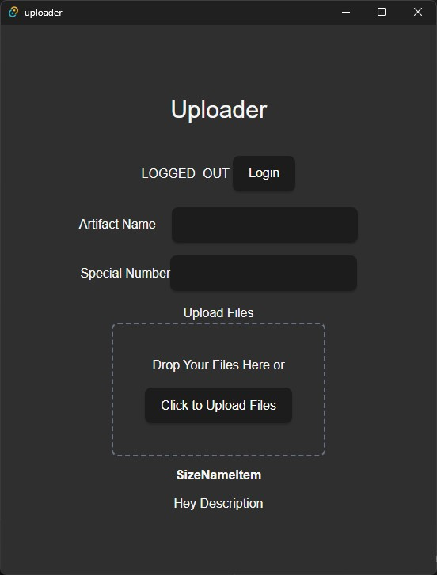

# Native Uploader Test

## Entra Application Registration

- Desktop App
- Call APIS Yes
  -  API Permissions Required User.Read
- Allow public client flows 
- Do not configure a credential (certificate/secret).
- Do not configure an Application ID URI.

### callback

Add `http://localhost:8080/callback`.

TODO: change to 127.0.0.1 with dynamic port number specified by app. localhost ports are considered equivalent
